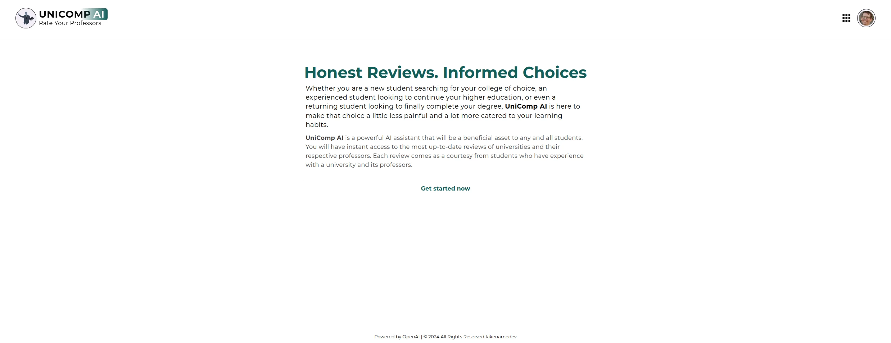
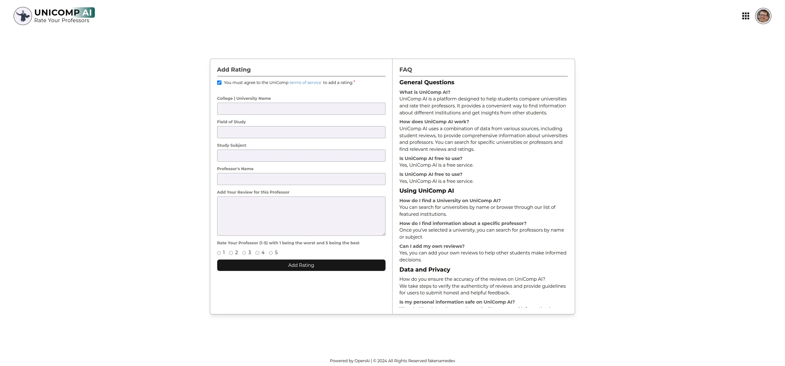
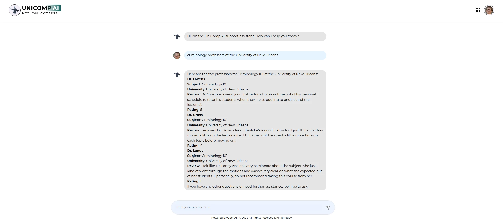

# UniComp AI - An AI Powered Professor Rating App

## Description

UniComp AI is project 5 of my fellowship with Headstarters. This application uses OpenAI which is given a System Prompt to use specific search parameters. Users looking for top-ranked professors can log on using Next Auth's Google Provider, and query the chatbot for specific Universities, Subjects and their respective Professors to see ratings uploaded by real students with real experience. Students who have experience with certain Universities and their professors can visit the directory page to contribute to the app with their own reviews and rankings.

## Usage

This app has a Next.JS Client and a Python Backend so you will need Python to run this app from the code found here in this repository.

```bash
  npm install
  npm run dev
```

This project uses [`next/font`](https://nextjs.org/docs/basic-features/font-optimization) to automatically optimize and load Montserrat, a custom Google Font.

## Deployed on Vercel

Visit UniComp AI [here](https://memoize-six.vercel.app/),
or on [my website](http://www.williamlowrimore.com)





## Technologies Used

- [Next.js](https://nextjs.org)
- [NextAuth](https://nextauth.com)
- [TailwindCSS](https://tailwindcss.com)
- [Open AI](https://platform.openai.com)
- [Pinecone](https://www.pinecone.io)
- [Prisma ORM](https://www.prisma.io)
- [PostgreSQL](https://www.postgresql.org)
- [Langchain](NPM)
- [React Icons](NPM)

## Resources

- [NextJS Docs](https://https://nextjs.org/docs)
- [Next Auth Docs](https://https:nextauth.com/docs)
- [Google Docs](https://docs.google.com)
- [Prisma ORM Docs](https://www.prisma.io/docs)
- [PostgreSQL Docs](https://www.postgresql.org/developer)
- [OpenAI Docs](https://platform.openai/docs)
- [Pinecone Docs](https://docs.pinecone.io)
- [Claude AI](https://claude.ai)
- [Codeium AI](https://codeium.com)
- [Gemini AI](https://gemini.google.com)
- Personal Docs

## Contact

- [wlowrimore@gmail.com](mailto://wlowrimore@gmail.com)
- [github/wlowrimore](https://github.com/wlowrimore)
- [williamlowrimore.com](http://williamlowrimore.com)
- [linkedIn/william-lowrimore-dev](https://linkedin.com/in/william-lowrimore-dev)
